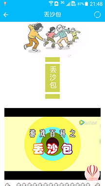

Childhood
---

> " 'CHILDHOOD' Software Based on Android Apps" that aimed to present classic childhood games for children in the 1970s and 1980s to kids in the 21st century. 

 

- Game rules ordered by recommendation system could help children find games that they may be interested in.

 

- Children could use the location-based service to find their childhood companions who live around them nearly. Ranking list and achievement system enhance chance that children do some outdoor activities with their childhood companions instead of staying at home with some computer or cellphone games. 

 

- Parents could play an important role on supervising game time in order to avoid the situation where their children spending too much time playing games but refusing to study. 

 

- Parents could provide some information about their childhood like the street they lived, the games they were interested in, and so on. And then, system could recommend some users who may spent time playing with them in their childhood according to their information to help parents find their childhood companions which they have lost the connection for many years.

 
